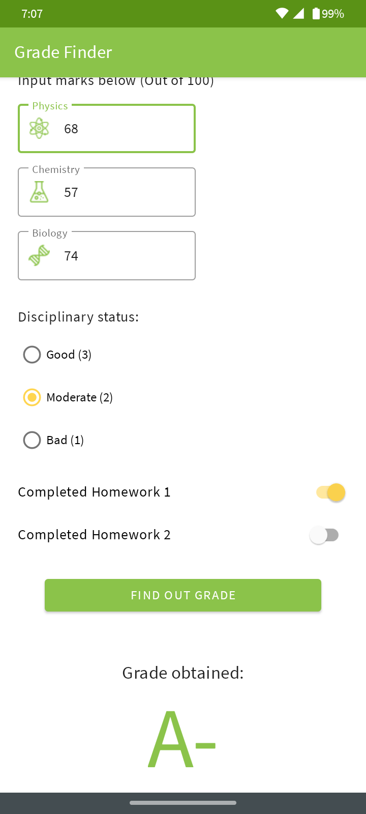
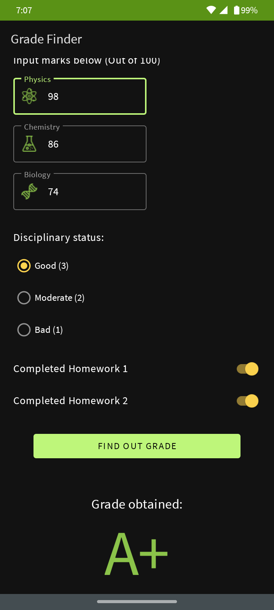

# Grade_Finder-Android
I made this app to test myself after finishing Level 2 of [Android Basic in Kotlin](https://developer.android.com/courses/android-basics-kotlin/course) from developers.android.com.

This is a simple grade finder application. It has 3 text fields for 3 marks of different subjects, a group of radio buttons for grade for disciplinary and 2 switches for homeworks. After inputing the required values it generates and shows a grade based on the values. The main mission was to test myself with fundamentals of android and follow the best practices.

